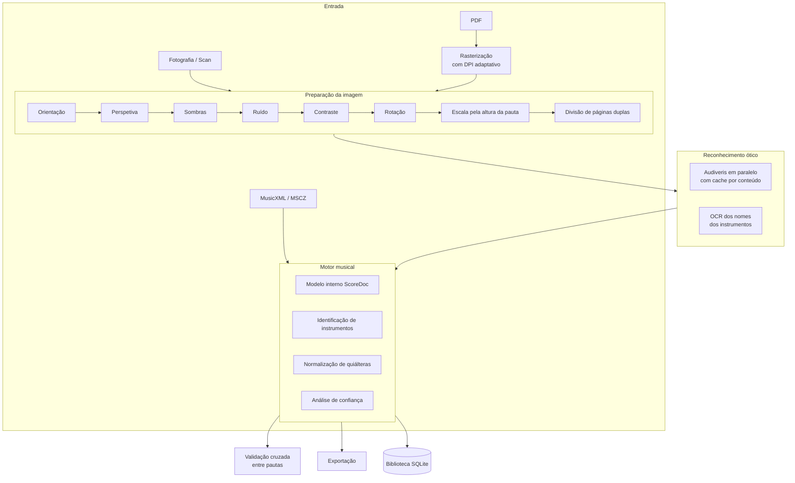

# BandScore AI

[](https://github.com/BrunoMinhava/bandscore-ai/actions/workflows/ci.yml)
[](LICENSE)
[](https://www.python.org)
[](#)

Aplicação desktop para **reconhecimento, edição, separação e gestão de partituras**,
pensada para bandas filarmónicas, orquestras, conservatórios e escolas de música.

Transforma um PDF, uma digitalização ou uma fotografia de uma partitura de maestro
numa **representação digital completa**, identifica os instrumentos, separa as partes
e exporta o papel individual de cada músico.

**Funciona inteiramente offline.** Todo o processamento corre na máquina local: não há
chamadas a serviços externos, nem APIs pagas, nem envio de partituras para a nuvem.

---

## Índice

- [O que faz](#o-que-faz)
- [Como funciona](#como-funciona)
- [Instalação](#instalação)
- [Utilização](#utilização)
- [Arquitetura](#arquitetura)
- [Decisões de engenharia](#decisões-de-engenharia)
- [Qualidade do reconhecimento](#qualidade-do-reconhecimento)
- [Desempenho](#desempenho)
- [Testes e verificação](#testes-e-verificação)
- [Limitações conhecidas](#limitações-conhecidas)
- [Roadmap](#roadmap)

---

## O que faz

| Etapa | Descrição |
|---|---|
| **Importar** | PDF, PNG, JPG, JPEG, BMP, TIFF, MusicXML, MXL e MSCZ. Os PDFs são rasterizados na resolução que o motor de reconhecimento precisa, calculada por sondagem. |
| **Reconhecer** | Correção automática das imagens e reconhecimento ótico musical num só passo, com barra de progresso e tempo estimado. |
| **Separar** | Instrumentos identificados e agrupados por família, com os compassos de leitura duvidosa assinalados. Clicar num instrumento mostra o seu papel individual. |
| **Exportar** | Obra completa ou um ficheiro por instrumento, em PDF, MusicXML, MXL, MSCZ, MIDI, PNG e SVG. |
| **Editar** | Visualização da partitura com zoom e desfazer. |
| **Reproduzir** | Áudio com misturador por instrumento, andamento variável, ciclo e metrónomo. |
| **Biblioteca** | Arquivo pesquisável por compositor, obra, instrumento, dificuldade, formação, ano e editor. |

### O que é reconhecido

Pautas, sistemas e instrumentos · notas, pausas e acordes · claves, armaduras e compassos
· ligaduras de expressão e de prolongação · quiálteras (tercinas, sextinas) com o número
e o lado corretos · dinâmicas (`p`, `f`, `sf`, …) e forquilhas de crescendo/diminuendo ·
articulações (staccato, acento, tenuto, fermata) · andamentos e textos · repetições,
**Da Capo**, **Dal Segno**, **Coda** e **Fine**.

---

## Como funciona



---

## Instalação

### Requisitos

- **Python 3.11+** e **Node.js 20+**
- **Audiveris** — motor de reconhecimento ótico musical *(obrigatório para reconhecer)*
- **MuseScore 4** — conversão para PDF, MSCZ, PNG e SVG *(obrigatório para exportar nesses formatos)*
- **Tesseract** — leitura dos nomes dos instrumentos *(opcional, melhora a identificação)*

| Ferramenta | macOS | Linux / Windows |
|---|---|---|
| Audiveris | Descarregar o `.dmg` das [releases](https://github.com/Audiveris/audiveris/releases) e colocar em `/Applications` | `.deb` / `.msi` das mesmas releases |
| MuseScore | `brew install --cask musescore` | [musescore.org](https://musescore.org) |
| Tesseract | `brew install tesseract` | `apt install tesseract-ocr` |

A aplicação deteta as três automaticamente e mostra o estado na barra lateral. Se
estiverem noutro sítio, indique o caminho por variável de ambiente:
`BANDSCORE_AUDIVERIS`, `BANDSCORE_MUSESCORE`, `BANDSCORE_TESSERACT`.

### Arranque

```bash
git clone https://github.com/BrunoMinhava/bandscore-ai.git
cd bandscore-ai

# Backend
cd backend
python3.12 -m venv .venv
.venv/bin/pip install -r requirements.txt

# Frontend
cd ../frontend
npm install

# Arrancar tudo (backend + interface + janela)
cd ..
./scripts/dev.sh
```

### Reconhecimento neuronal (opcional)

```bash
cd backend && .venv/bin/pip install -r requirements-ml.txt
```

Modelos de deteção de símbolos em ONNX colocam-se em
`~/Library/Application Support/BandScoreAI/models/`. O contrato está documentado em
[`app/pipeline/recognition/symbols.py`](backend/app/pipeline/recognition/symbols.py).
A GPU (CUDA ou Metal) é usada automaticamente quando existe.

---

## Utilização

1. **Novo projeto** ou **Abrir PDF** na página inicial.
2. **Reconhecer** — prepara as imagens e reconhece a música de seguida, mostrando a
   percentagem e o tempo que falta.
3. **Separar** — confirmar os instrumentos identificados. Os que o motor não conseguiu
   nomear ficam como «Pauta N» e podem ser atribuídos pelo seletor. Clicar numa linha
   mostra o papel individual desse instrumento.
4. **Exportar** — escolher instrumentos e formatos. Com «ficheiros individuais», cada
   instrumento gera o seu próprio PDF (`Obra - Trompete I.pdf`).

Os dados ficam em `~/Library/Application Support/BandScoreAI/` (macOS),
`%APPDATA%\BandScoreAI\` (Windows) ou `~/.local/share/BandScoreAI/` (Linux).

---

## Arquitetura

Monorepo com dois processos que comunicam por HTTP local na porta `8765`.

```
bandscore-ai/
├── backend/                    Python · FastAPI · SQLite
│   └── app/
│       ├── api/                endpoints REST
│       ├── core/               configuração, base de dados, trabalhos em segundo plano
│       ├── engine/             modelo musical interno e ponte para music21
│       ├── pipeline/
│       │   ├── preprocessing/  correção de imagem (OpenCV)
│       │   └── recognition/    Audiveris, instrumentos, confiança, OCR
│       ├── validation/         verificação e comparação entre pautas
│       ├── exporters/          MusicXML, MIDI, e MuseScore CLI
│       └── library/            catálogo pesquisável
└── frontend/                   Electron · React · TypeScript · Tailwind
    ├── electron/               processo principal e ponte segura
    └── src/                    páginas, componentes, cliente da API
```

### Módulos do backend

| Módulo | Responsabilidade |
|---|---|
| `pipeline/preprocessing` | Orientação, perspetiva, sombras, ruído, contraste, rotação, normalização de escala, páginas duplas, deteção de cortes e aferição de qualidade |
| `pipeline/recognition` | Audiveris em paralelo com cache, junção de páginas, identificação de instrumentos, OCR dos nomes, sistema de confiança |
| `engine` | Modelo interno completo, conversão de e para MusicXML, navegação musical (repetições, D.C., D.S., Coda, Fine), histórico para desfazer |
| `validation` | Durações, âmbitos, ligaduras, repetições e **comparação entre pautas** |
| `exporters` | Obra completa ou partes separadas em sete formatos |
| `library` | Registo automático das obras reconhecidas, pesquisável |

### O modelo musical

Cada nota do modelo interno guarda altura, oitava, duração, posição, instrumento,
compasso, página, voz, camada, dinâmica, articulações, ligaduras, forquilha, acidente,
quiáltera (proporção, delimitação e lado do número), nível de confiança e leituras
alternativas. É serializado em `score.json` dentro de cada projeto — legível, com
histórico de versões para desfazer, e independente de qualquer formato externo.

---

## Decisões de engenharia

Algumas escolhas não são óbvias e foram tomadas a partir de medições em partituras
reais. Ficam registadas porque explicam o código.

**A resolução é escolhida pela altura da pauta, não por um DPI fixo.** O que determina
a qualidade do reconhecimento é a distância entre as linhas da pauta em pixels
(*interline*), não o DPI. Na importação, uma página de sondagem é rasterizada, mede-se
a pauta e extrapola-se a resolução certa. Rasterizar o PDF na resolução adequada
acrescenta detalhe verdadeiro; ampliar uma imagem pequena apenas interpola pixels e
custa tempo sem ganho.

**O tamanho da folha tem um teto rígido.** O Audiveris ignora silenciosamente folhas
acima de cerca de 5000 px por lado — não dá erro, limita-se a devolver «Sheet ignored».
Medido: 3509×4963 passa, 4094×5790 é ignorada. A resolução calculada é limitada para
nunca ultrapassar esse valor.

**A orientação é decidida por contagem de pautas, nunca por OCR.** O Tesseract oferece
deteção de rotação, mas numa página de música há pouco texto e ele adivinha: numa
partitura de 24 páginas devolveu «180°» em 8 delas, que eram viradas ao contrário e
ficavam ilegíveis. O critério passou a ser a contagem de pautas detetadas em cada
orientação, que é verificável. Existe um [teste de regressão](backend/tests/test_navigation.py)
a proteger isto.

**Páginas mal lidas são excluídas, não integradas.** Quando o reconhecimento devolve
para uma página um número de pautas diferente do resto da obra, essa página foi mal
interpretada. Juntá-la pela posição despejaria compassos inventados nas primeiras
pautas e corromperia tudo. É excluída e assinalada ao utilizador.

**Um nome errado é pior do que nenhum.** Na identificação por OCR, `bass` sozinho é
ambíguo numa banda — *bass clarinet*, *bass drum*, *bass trombone*, *double bass* — e
gerava Tubas falsas. O alias foi removido: nomes que não têm correspondência segura
ficam por atribuir, para o utilizador decidir.

**As quiálteras são respeitadas como estão escritas.** A proporção, a delimitação do
colchete e o lado do número são lidos do original e preservados. Duas tercinas
contíguas só se tornam uma sextina quando ocupam **exatamente um tempo** — que é a
assinatura da sextina; duas tercinas de colcheias ocupam dois tempos e continuam duas
tercinas.

**A barra de compassos é reconstruída pela duração real quando é preciso.** O music21
não dá erro quando a duração de um compasso não bate com a métrica: devolve
silenciosamente zero barras de ligação, e a pauta sai com todas as figuras de colchete
solto. Compassos irregulares passam a ser pautados pela duração do conteúdo, mantendo
impressa a métrica correta.

---

## Qualidade do reconhecimento

A aplicação não se limita a converter: **verifica-se a si própria** e diz onde não
confia.

**Comparação entre pautas.** Numa partitura de maestro, todas as pautas são
metricamente idênticas no mesmo compasso. Quando uma discorda das restantes, o erro é
dela — e a maioria diz qual devia ser o valor. É a fonte de verdade mais forte para
detetar barras de compasso falhadas, e permite estimar quantas faltam.

> *Compasso 7: 3,25 tempos, mas 6 de 7 pautas têm 3 — provável 1 barra de compasso em falta*

**Âmbito dos instrumentos.** Uma nota fora do âmbito real do instrumento é assinalada
com a alternativa mais provável (tipicamente um erro de oitava).

**Aferição prévia da imagem.** Antes de gastar minutos, a aplicação mede a pauta e
recusa imagens sem resolução suficiente, dizendo em português e com números concretos
o que é preciso:

> *Imagem com pouca resolução: as linhas da pauta estão a 9,5 pixels de distância e são
> precisos pelo menos 11. Esta imagem tem 1017×1440 px; para esta partitura seriam
> precisos cerca de 2141×3031 px.*

Os compassos duvidosos aparecem marcados por instrumento no passo **Separar**, e há um
botão para aceitar todas as leituras de uma vez em vez de confirmar nota a nota.

---

## Desempenho

Medições numa partitura real de banda: 24 páginas A3, 22 instrumentos, num MacBook de
10 núcleos.

| | Antes | Depois |
|---|---|---|
| Reconhecimento (3 páginas) | 63 s | **28 s** |
| Obra completa (24 páginas) | ~8,4 min | **3,7 min** |
| Ciclo completo com preparação | 15+ min | **5,1 min** |
| Segunda passagem sem alterações | igual | **instantânea** (cache) |

As páginas são processadas em paralelo, com o número de trabalhadores limitado a 4: o
Audiveris já usa cerca de três núcleos por processo e ocupa perto de 2 GB, por isso um
processo por núcleo seria contraproducente. O resultado de cada página é guardado por
*hash* do conteúdo, e páginas inalteradas não voltam a ser processadas.

---

## Testes e verificação

```bash
cd backend
.venv/bin/python -m pytest        # 19 testes
.venv/bin/ruff check app tests    # análise estática

cd ../frontend
npx tsc --noEmit                  # TypeScript estrito
npm run build
```

A cobertura incide sobre a lógica onde um erro é silencioso e caro: navegação musical
(repetições, D.C., D.S., Coda, Fine, e a regra de que as repetições não se retomam
depois de um Da Capo), identificação de instrumentos a partir de abreviaturas e de
texto colado pelo OCR, e a regressão da orientação de página.

---

## Limitações conhecidas

São limites reais, medidos, não hipóteses.

**Fotografias de partituras de maestro.** Uma A3 com 24 instrumentos fotografada com o
telemóvel produz cerca de 9 pautas legíveis. A folha curva e em perspetiva distorce as
linhas, e a altura de uma nota lê-se pela posição relativa a essas linhas. Para estas
partituras, digitalização a 300 DPI. A fotografia funciona bem para **papéis
individuais**, onde as pautas são poucas e grandes.

**Correção de curvatura.** Foi implementada e **removida**: numa partitura real, a
deteção de pautas piorou de 9 para 0, porque os desvios acumulados entre faixas
verticais geravam uma deriva falsa. Preferiu-se não ter a funcionalidade a tê-la a
estragar o resultado.

**Partituras antigas sem nomes impressos.** O motor não consegue nomear as pautas e
elas surgem como «Pauta N». O OCR recupera os nomes quando estão impressos — numa
página de rosto real identificou 20 de 22 instrumentos — mas nem todas as edições os
trazem. A atribuição manual está a um clique.

**Edição de notas.** O editor mostra a partitura com zoom e permite desfazer; a edição
nota a nota está no roadmap.

---

## Roadmap

- Edição nota a nota no editor
- Modelos YOLOv11 treinados em partituras como segunda opinião ao motor principal
- Reprodução com *soundfont* em vez de síntese
- Digitalização direta (TWAIN / ICA)
- Comparação entre edições e deteção de diferenças
- Transposição automática e redução para piano
- Reconhecimento de manuscritos
- Empacotamento com `electron-builder` e backend embutido

---

## Tecnologias

**Frontend** — React 18, TypeScript, Tailwind CSS 4, Electron 33, Framer Motion,
React Query, Zustand, OpenSheetMusicDisplay

**Backend** — Python 3.12, FastAPI, SQLAlchemy, SQLite, OpenCV, NumPy, PyMuPDF,
music21, Tesseract

**Reconhecimento** — Audiveris (OMR), MuseScore CLI (conversão), suporte opcional para
ONNX Runtime, PyTorch e YOLOv11

---

## Licença

MIT — ver [LICENSE](LICENSE).

O Audiveris é distribuído sob AGPL e o MuseScore sob GPL. São usados como ferramentas
externas, invocadas por linha de comandos, e não são redistribuídos com este projeto.
