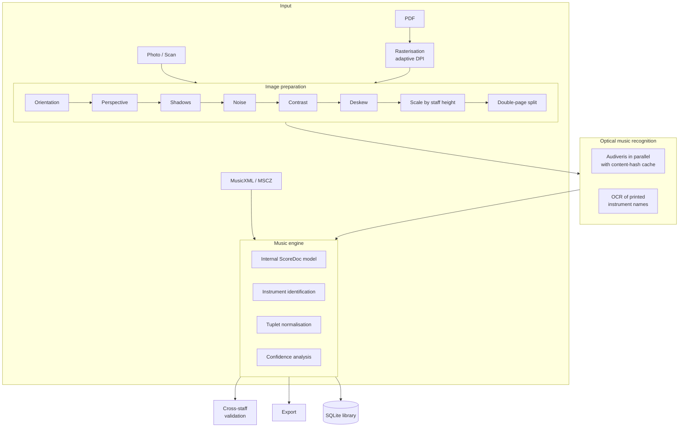

# BandScore AI

[](https://github.com/BrunoMinhava/bandscore-ai/actions/workflows/ci.yml)
[](LICENSE)
[](https://www.python.org)
[](#)

Desktop application for **optical music recognition, editing, part separation and score
management**, built for concert bands, orchestras, conservatories and music schools.

It turns a PDF, a scan or a photograph of a conductor's score into a **complete digital
representation**, identifies the instruments, separates the parts and exports the
individual sheet each musician plays from.

**Runs entirely offline.** All processing happens on the local machine: no external
services, no paid APIs, and no scores leaving the computer.

---

> ### ⚠️ Work in progress
>
> This is an **ongoing v0.1**, not a finished product. What is described here works and
> was measured on real scores, but recognition is **not 100% reliable** and the output
> always needs human review.
>
> **What already works well:** scores digitised at 300 DPI or good-quality PDFs, part
> separation, export to all seven formats, automatic instrument identification, and
> flagging of uncertain measures.
>
> **What still fails:** phone photographs of large conductor's scores (see
> [Known limitations](#known-limitations)); older scores with no instrument names printed
> on the staves; and roughly **14% of the measures** in a real A3 score ended up flagged
> as uncertain — the application tells you which ones, but correcting them is manual.
> Note-level editing does not exist yet.
>
> This is why the application **always shows where it is not confident**, instead of
> presenting the result as correct. See [Recognition quality](#recognition-quality).

---

## Table of contents

- [What it does](#what-it-does)
- [How it works](#how-it-works)
- [Installation](#installation)
- [Usage](#usage)
- [Architecture](#architecture)
- [Engineering decisions](#engineering-decisions)
- [Recognition quality](#recognition-quality)
- [Performance](#performance)
- [Testing and verification](#testing-and-verification)
- [Known limitations](#known-limitations)
- [Roadmap](#roadmap)

---

## What it does

| Stage | Description |
|---|---|
| **Import** | PDF, PNG, JPG, JPEG, BMP, TIFF, MusicXML, MXL and MSCZ. PDFs are rasterised at the resolution the recognition engine actually needs, determined by probing the page. |
| **Recognise** | Image correction and optical music recognition in a single step, with a progress bar and estimated time remaining. |
| **Separate** | Instruments identified and grouped by family, with uncertain measures flagged per part. Clicking an instrument shows its individual sheet. |
| **Export** | Full score or one file per instrument, as PDF, MusicXML, MXL, MSCZ, MIDI, PNG and SVG. |
| **Edit** | Score rendering with zoom and undo. |
| **Play** | Audio playback with a per-instrument mixer, variable tempo, looping and a metronome. |
| **Library** | Searchable archive by composer, title, instrument, difficulty, ensemble, year and publisher. |

### What gets recognised

Staves, systems and instruments · notes, rests and chords · clefs, key and time signatures
· slurs and ties · tuplets (triplets, sextuplets) with the correct number and placement ·
dynamics (`p`, `f`, `sf`, …) and crescendo/diminuendo hairpins · articulations (staccato,
accent, tenuto, fermata) · tempo marks and text · repeats, **Da Capo**, **Dal Segno**,
**Coda** and **Fine**.

---

## How it works



---

## Installation

### Requirements

- **Python 3.11+** and **Node.js 20+**
- **Audiveris** — optical music recognition engine *(required for recognition)*
- **MuseScore 4** — conversion to PDF, MSCZ, PNG and SVG *(required for those formats)*
- **Tesseract** — reading printed instrument names *(optional, improves identification)*

| Tool | macOS | Linux / Windows |
|---|---|---|
| Audiveris | Download the `.dmg` from [releases](https://github.com/Audiveris/audiveris/releases) and place it in `/Applications` | `.deb` / `.msi` from the same releases |
| MuseScore | `brew install --cask musescore` | [musescore.org](https://musescore.org) |
| Tesseract | `brew install tesseract` | `apt install tesseract-ocr` |

The application detects all three automatically and shows their status in the sidebar. If
they live elsewhere, point to them with environment variables: `BANDSCORE_AUDIVERIS`,
`BANDSCORE_MUSESCORE`, `BANDSCORE_TESSERACT`.

### Getting started

```bash
git clone https://github.com/BrunoMinhava/bandscore-ai.git
cd bandscore-ai

# Backend
cd backend
python3.12 -m venv .venv
.venv/bin/pip install -r requirements.txt

# Frontend
cd ../frontend
npm install

# Start everything (backend + UI + window)
cd ..
./scripts/dev.sh
```

### Neural recognition (optional)

```bash
cd backend && .venv/bin/pip install -r requirements-ml.txt
```

ONNX symbol-detection models go in `~/Library/Application Support/BandScoreAI/models/`.
The contract is documented in
[`app/pipeline/recognition/symbols.py`](backend/app/pipeline/recognition/symbols.py).
GPU (CUDA or Metal) is used automatically when available.

---

## Usage

1. **New project** or **Open PDF** from the home screen.
2. **Recognise** — prepares the images and recognises the music in one go, showing
   percentage complete and time remaining.
3. **Separate** — confirm the identified instruments. Staves the engine could not name
   appear as "Pauta N" and can be assigned from a dropdown. Clicking a row shows that
   instrument's individual sheet.
4. **Export** — pick instruments and formats. With "individual files", each instrument
   produces its own PDF (`Work - Trumpet I.pdf`).

Data lives in `~/Library/Application Support/BandScoreAI/` (macOS),
`%APPDATA%\BandScoreAI\` (Windows) or `~/.local/share/BandScoreAI/` (Linux).

---

## Architecture

A monorepo with two processes communicating over local HTTP on port `8765`.

```
bandscore-ai/
├── backend/                    Python · FastAPI · SQLite
│   └── app/
│       ├── api/                REST endpoints
│       ├── core/               configuration, database, background jobs
│       ├── engine/             internal music model and music21 bridge
│       ├── pipeline/
│       │   ├── preprocessing/  image correction (OpenCV)
│       │   └── recognition/    Audiveris, instruments, confidence, OCR
│       ├── validation/         verification and cross-staff comparison
│       ├── exporters/          MusicXML, MIDI, and MuseScore CLI
│       └── library/            searchable catalogue
└── frontend/                   Electron · React · TypeScript · Tailwind
    ├── electron/               main process and secure bridge
    └── src/                    pages, components, API client
```

> **Note on language:** identifiers, comments and docstrings in the source are written in
> Portuguese, the working language of the target users (Portuguese concert bands). The
> documentation and public interfaces are in English.

### Backend modules

| Module | Responsibility |
|---|---|
| `pipeline/preprocessing` | Orientation, perspective, shadows, noise, contrast, deskew, scale normalisation, double-page splitting, edge-cut detection and quality assessment |
| `pipeline/recognition` | Parallel Audiveris with caching, page merging, instrument identification, name OCR, confidence system |
| `engine` | Complete internal model, conversion to and from MusicXML, musical navigation (repeats, D.C., D.S., Coda, Fine), undo history |
| `validation` | Durations, instrument ranges, ties, repeats and **cross-staff comparison** |
| `exporters` | Full score or separate parts in seven formats |
| `library` | Automatic registration of recognised works, searchable |

### The music model

Every note in the internal model carries pitch, octave, duration, position, instrument,
measure, page, voice, layer, dynamic, articulations, ties, hairpin, accidental, tuplet
(ratio, bracket span and number placement), confidence level and alternative readings. It
is serialised to `score.json` inside each project — human-readable, with version history
for undo, and independent of any external format.

---

## Engineering decisions

Some choices are not obvious and were made from measurements on real scores. They are
recorded here because they explain the code.

**Resolution is chosen from staff height, not a fixed DPI.** What determines recognition
quality is the distance between staff lines in pixels (*interline*), not DPI. On import, a
probe page is rasterised, the staff is measured, and the right resolution is extrapolated.
Rasterising the PDF at the proper resolution adds real detail; upscaling a small image only
interpolates pixels and costs time for no gain.

**Sheet size has a hard ceiling.** Audiveris silently ignores sheets above roughly 5000 px
per side — it raises no error, it simply reports "Sheet ignored". Measured: 3509×4963
passes, 4094×5790 is ignored. The computed resolution is capped so this is never exceeded.

**Orientation is decided by staff count, never by OCR.** Tesseract offers rotation
detection, but a page of music has little text and it guesses: on a 24-page score it
returned "180°" for 8 of them, which were then flipped upside down and became unreadable.
The criterion is now the number of staves detected in each orientation, which is
verifiable. A [regression test](backend/tests/test_navigation.py) guards this.

**Misread pages are excluded, not merged.** When recognition returns a different number of
staves for one page than for the rest of the work, that page was misinterpreted. Merging it
by position would dump invented measures into the first few parts and corrupt everything.
It is excluded and reported to the user.

**A wrong name is worse than no name.** In OCR-driven identification, `bass` alone is
ambiguous in a concert band — *bass clarinet*, *bass drum*, *bass trombone*, *double bass* —
and produced false tubas. The alias was removed: names without a safe match are left
unassigned for the user to decide.

**Tuplets are preserved as written.** The ratio, bracket span and number placement are read
from the original and kept. Two adjacent triplets only become a sextuplet when they fill
**exactly one beat** — the signature of a sextuplet; two eighth-note triplets span two
beats and remain two triplets.

**Beaming is rebuilt from actual duration when needed.** music21 raises no error when a
measure's duration disagrees with its time signature: it silently returns zero beams, and
the part comes out with every note flagged individually. Irregular measures are now beamed
according to their actual content while still printing the correct time signature.

---

## Recognition quality

The application does not merely convert: it **checks itself** and says where it is not
confident.

**Cross-staff comparison.** In a conductor's score, every staff is metrically identical at
the same measure. When one disagrees with the rest, the error is that staff's — and the
majority tells us what the value should have been. This is the strongest available source
of truth for detecting missed barlines, and it allows estimating how many are missing.

> *Measure 7: 3.25 beats, but 6 of 7 staves have 3 — probably 1 missing barline*

**Instrument ranges.** A note outside an instrument's real range is flagged with the most
likely alternative (typically an octave error).

**Up-front image assessment.** Before spending minutes, the application measures the staff
and rejects images without sufficient resolution, stating in concrete numbers what is
needed:

> *Low resolution for music recognition: staff lines are 9.5 pixels apart and at least 11
> are required. This image is 1017×1440 px; this score would need roughly 2141×3031 px.*

Uncertain measures are flagged per instrument in the **Separate** step, and a single button
accepts all readings at once instead of confirming note by note.

---

## Performance

Measured on a real concert-band score: 24 A3 pages, 22 instruments, on a 10-core MacBook.

| | Before | After |
|---|---|---|
| Recognition (3 pages) | 63 s | **28 s** |
| Full work (24 pages) | ~8.4 min | **3.7 min** |
| Complete cycle including preparation | 15+ min | **5.1 min** |
| Second pass with no changes | same | **instant** (cache) |

Pages are processed in parallel with the worker count capped at 4: Audiveris already uses
about three cores per process and occupies close to 2 GB, so one process per core would be
counterproductive. Each page's result is stored under a hash of its content, and unchanged
pages are never reprocessed.

---

## Testing and verification

```bash
cd backend
.venv/bin/python -m pytest        # 19 tests
.venv/bin/ruff check app tests    # static analysis

cd ../frontend
npx tsc --noEmit                  # strict TypeScript
npm run build
```

Coverage targets the logic where a mistake is silent and expensive: musical navigation
(repeats, D.C., D.S., Coda, Fine, and the rule that repeats are not taken again after a Da
Capo), instrument identification from abbreviations and OCR-mangled text, and the page
orientation regression.

---

## Known limitations

These are measured limits, not hypotheses.

**Photographs of conductor's scores.** An A3 sheet with 24 instruments photographed with a
phone yields around 9 legible staves. The page curves and sits at an angle, distorting the
lines — and a note's pitch is read from its position relative to those lines. For such
scores, scan at 300 DPI. Photography works well for **individual parts**, where staves are
few and large.

**Curvature correction.** It was implemented and then **removed**: on a real score, staff
detection degraded from 9 staves to 0, because accumulated drift between vertical strips
produced a false displacement. Not having the feature was preferable to having it damage
the result.

**Older scores with no printed names.** The engine cannot name the staves and they appear
as "Pauta N". OCR recovers the names when they are printed — on a real title page it
identified 20 of 22 instruments — but not every edition prints them. Manual assignment is
one click away.

**Note editing.** The editor renders the score with zoom and supports undo; note-by-note
editing is on the roadmap.

---

## Roadmap

- Note-by-note editing in the editor
- YOLOv11 models trained on sheet music as a second opinion to the main engine
- Soundfont-based playback instead of synthesis
- Direct scanning (TWAIN / ICA)
- Edition comparison and difference detection
- Automatic transposition and piano reduction
- Handwritten manuscript recognition
- Packaging with `electron-builder` and an embedded backend

---

## Technologies

**Frontend** — React 18, TypeScript, Tailwind CSS 4, Electron 33, Framer Motion,
React Query, Zustand, OpenSheetMusicDisplay

**Backend** — Python 3.12, FastAPI, SQLAlchemy, SQLite, OpenCV, NumPy, PyMuPDF,
music21, Tesseract

**Recognition** — Audiveris (OMR), MuseScore CLI (conversion), optional support for
ONNX Runtime, PyTorch and YOLOv11

---

## License

MIT — see [LICENSE](LICENSE).

Audiveris is distributed under AGPL and MuseScore under GPL. They are used as external
tools, invoked through the command line, and are not redistributed with this project.
